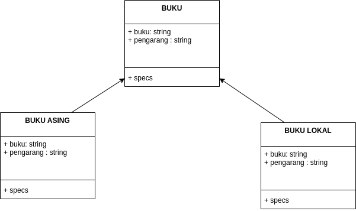

# PENJELASAN
---
### 1. OVERLOADING

OverLoading adalah sebuah keadaan dimana class memiliki nama method yang sama dengan parameter berbeda.

### 2.OVERRIDING

Overriding adalah sebuah keadaan dimana class parent dan class children terdapat method yang memiliki nama yang sama dan parameter yang sama

**Note:**
> Didalam PHP untuk menggunakan method overloading kita hanya membutuhkan funsi yang disebut "**__CALL()**" dengan parameter pertama sebagai **NAMA FUNSI** dan parameter kedua sebagai **ARGUMENT/PARAMETER**

# STUDY KASUS
---
Terdapat sebuah class parent dengan nama BUKU yang memiliki overloading dengan nama specs, dimana class BUKU memiliki children dengan nama BUKU LOCAL dan BUKU ASING yang memiliki overriding bernama specs terhadap class parentnya yaitu BUKU

#### SKEMA CLASS DIAGRAM :

